<div align="center">



[](https://github.com/alexnodeland/whisk/actions/workflows/ci.yml)
[](https://github.com/alexnodeland/whisk/releases)
[](#license)
[](#install)
[](#contributing)

**Folders don't stay clean. Whisk makes that someone else's problem.**

A rule-driven tidying utility for the macOS menu bar — a lightweight, scriptable take on Hazel.

```json5
{ match: { extension: ["dmg"], age: { olderThan: "7d" } }, actions: [{ trash: {} }] }
```

**[alexnodeland.github.io/whisk](https://alexnodeland.github.io/whisk/)**

</div>

---

<table>
<tr>
<td width="50%" valign="top">

### What you point it at

A folder that accretes: screenshots next to installers next to last month's
invoices, the `(2)` and `(3)` copies of things you downloaded twice.

```
~/Downloads
├── Screenshot 2026-08-25 at 09.14.02.png
├── Whisk-universal (2).zip
├── invoice (3).pdf
├── OldApp.dmg                 ← from July
├── IMG_4231.heic
└── … 60 more
```

</td>
<td width="50%" valign="top">

### What it keeps

The same folder, but every file that matches a rule has been moved where it
belongs, renamed to something findable, or aged into the Trash — and the
folder holds only what arrived today.

```
~/Downloads
└── Whisk-universal.zip        ← still fresh

~/Pictures/Inbox/2026-08
├── IMG_4231.heic
└── screenshot-2026-08-25.png
```

</td>
</tr>
</table>

```
~/Downloads · swept

  → moved    IMG_4231.heic                ~/Pictures/Inbox/2026-08
  → renamed  Screenshot 2026-08-25 ….png  screenshot-2026-08-25.png
  → trashed  OldApp.dmg                   added 32 days ago
  → ran      my-unpack                    archive.zip
                                          …
  Whisk: 4 actions in Downloads
```

<br>

## Install

<table>
<tr><th align="left">Method</th><th align="left">Command</th></tr>
<tr>
<td><a href="https://brew.sh">Homebrew</a> <sub>recommended</sub></td>
<td>

```bash
brew tap alexnodeland/tap
brew install --cask whisk
```

Newer Homebrew requires a one-time `brew trust alexnodeland/tap` for
third-party taps — it will tell you if yours does.

</td>
</tr>
<tr>
<td>Direct download</td>
<td>

Grab `Whisk-universal.zip` from the
[latest release](https://github.com/alexnodeland/whisk/releases/latest),
unzip, drag `Whisk.app` to Applications.

</td>
</tr>
</table>

Builds are currently unsigned, so macOS blocks the first launch either way
until you clear the quarantine flag once:

```bash
xattr -dr com.apple.quarantine /Applications/Whisk.app
```

On first launch Whisk writes a starter rules file to `~/.config/whisk/rules.json`
and macOS asks for access to the folders your rules target — the standard
consent prompts, nothing more. Whisk never touches a folder you didn't list.

<br>

## Features

|  |  |
| --- | --- |
| 📝 **A rules file, not a database** | `~/.config/whisk/rules.json` is the source of truth — JSON5 with comments, hot-reloaded on every save, versionable and syncable. A built-in editor covers the common cases. |
| 🔍 **Conditions that compose** | name globs and regexes, extensions, file/folder kind, size, and age (created / modified / added), nested under `all` / `any` / `not`. |
| 📦 **Four actions** | move/copy with date-pattern destinations, rename templates, Trash-by-age, and shell commands. |
| 🫥 **Dry-run first** | preview mode announces every action it *would* take, and takes none. |
| 🛡 **Runaway-proof** | a self-write ledger, per-file cooldowns, and action budgets that auto-pause a misbehaving rule instead of letting it loop. |
| 🗑 **Undo-friendly** | Trash, never delete. Every removal stays recoverable. |
| 🔔 **Notifications you control** | per rule and globally, batched per sweep. |
| 🔗 **Scriptable** | `whisk://sweep`, `pause`, `resume`, `dry-run` — plus an append-only JSONL activity log for your own tooling. |

<br>

## How it works

<div align="center">

</div>

<table>
<tr>
<td width="33%" valign="top">

### Events trigger, never decide

FSEvents, age timers, and a safety-net rescan only *wake* Whisk. Every sweep
re-enumerates the whole folder from scratch, so a missed or coalesced event
costs nothing — the next look at the folder is always the truth.

</td>
<td width="33%" valign="top">

### The planner is pure

One function turns a folder snapshot plus your rules into a list of planned
actions. It performs no I/O, and CI holds it at 100% region coverage — every
branch of the matching, pattern, and budget logic is exercised.

</td>
<td width="33%" valign="top">

### Actions go through guards

Plans execute through thin, audited shims: cycle-refusing moves, budget
counters, and Trash instead of delete. Shell commands run argv-only in a
sanitized environment, and only after you approve them once.

</td>
</tr>
</table>

### Built to be trusted

<div align="center">

</div>

<br>

## Rules

```json5
// ~/.config/whisk/rules.json — reloaded whenever it changes
{
  version: 1,
  targets: [
    {
      path: "~/Downloads",
      rules: [
        {
          id: "file-images",
          match: { all: [
            { name: { glob: "*.{png,jpg,jpeg,heic}" } },
            { size: { over: "100KB" } },
          ]},
          actions: [
            { move: { to: "~/Pictures/Inbox/{date.modified:yyyy-MM}", onConflict: "rename" } },
          ],
        },
        {
          id: "trash-old-installers",
          match: { all: [
            { extension: ["dmg", "pkg"] },
            { age: { basis: "added", olderThan: "7d" } },
          ]},
          actions: [ { trash: {} } ],
        },
        {
          id: "unpack",
          notify: false,
          match: { extension: ["zip"] },
          actions: [ { run: { command: "/opt/homebrew/bin/my-unpack", timeoutSeconds: 60 } } ],
        },
      ],
    },
  ],
}
```

Rules apply in order; a file consumed by `move` or `trash` is skipped by later
rules in the same sweep, so ordering is a feature, not a hazard.

### Vocabulary

| Condition | Matches on |
| --- | --- |
| `name` | a `glob` (`*.{png,jpg}`) or a `regex` |
| `extension` | any of a list, case-insensitive |
| `kind` | `file` or `folder` |
| `size` | `over` / `under`, human units (`100KB`, `2GB`) |
| `age` | `olderThan` / `newerThan` (`7d`, `12h`), basis `created` / `modified` / `added` |
| `all` · `any` · `not` | nesting, to any depth |

| Action | Does |
| --- | --- |
| `move` / `copy` | to a destination that may use `{name}`, `{ext}`, and `{date.*:FORMAT}` tokens, with `onConflict: rename` (Finder-style " 2") / `skip` / `replace` |
| `rename` | to a token pattern, in place |
| `trash` | to the Trash — recoverable, never a delete |
| `run` | an executable, argv-only, file path appended plus `WHISK_FILE` in the environment; held until approved once from the menu |

The full schema and semantics live in
[`docs/rfcs/0001-whisk.md`](docs/rfcs/0001-whisk.md).

### URL scheme

| URL | Effect |
| --- | --- |
| `whisk://sweep` | Sweep every target now |
| `whisk://pause` / `whisk://pause?minutes=60` | Pause (indefinitely / for a while) |
| `whisk://resume` | Resume sweeping |
| `whisk://dry-run?enabled=true` | Toggle preview mode |

### On disk

| Path | Holds |
| --- | --- |
| `~/.config/whisk/rules.json` | your rules — the only file that's yours to edit |
| `~/Library/Application Support/Whisk/activity.jsonl` | what Whisk did, one JSON object per action |
| `~/Library/Application Support/Whisk/approvals.json` | the shell commands you've approved |

<br>

## Contributing

Issues and PRs welcome — see [CONTRIBUTING](.github/CONTRIBUTING.md).
Behavior is specified as Gherkin in [`docs/acceptance/`](docs/acceptance/),
each scenario mapping to an XCTest; decisions are recorded as ADRs in
[`docs/adr/`](docs/adr/). New behavior needs a scenario, and the logic core
stays at 100% region coverage — the gate fails otherwise.

```bash
just setup   # one-time: tools + git hooks
just check   # the full CI gate: lint, format, shim audit, coverage, integration
```

<br>

## A note on what it touches

Whisk acts only on the folders your rules list, asks macOS for consent to each
one, and prefers reversible operations — the Trash over deletion, previews
over surprises. The riskiest thing it can do is run a script you wrote, and it
won't do that until you've approved that exact command once.

<br>

## License

[MIT](LICENSE) © [alexnodeland](https://github.com/alexnodeland)
